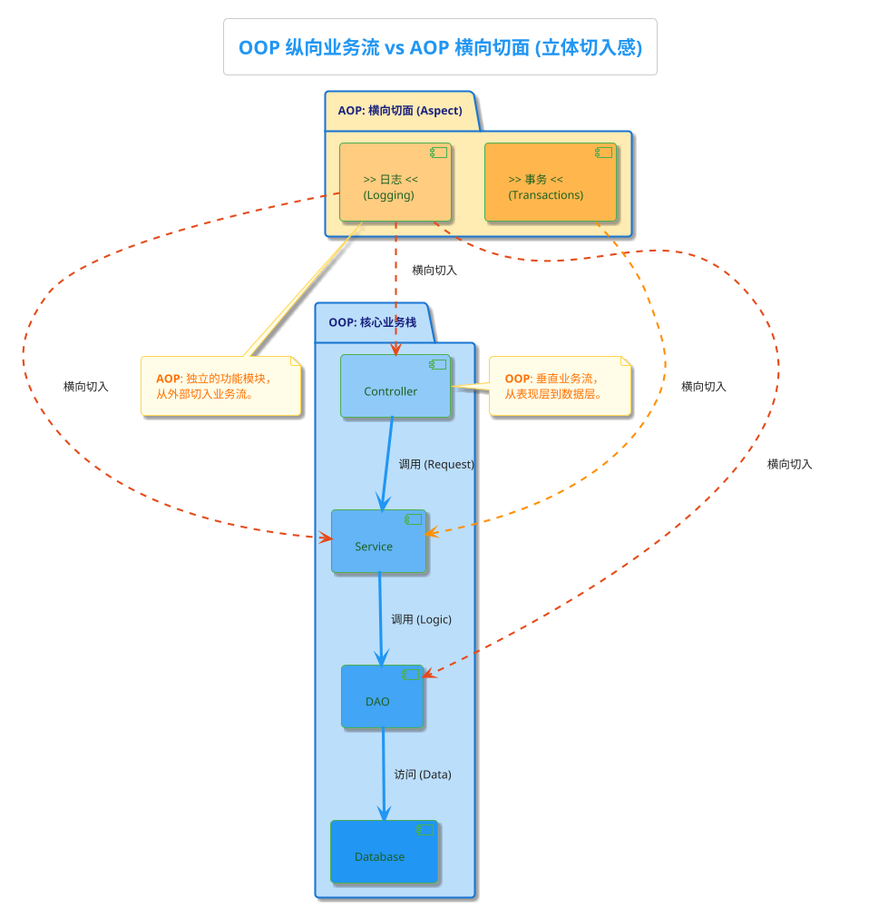

# 前言
最近阅读dummy-AOP，这个精简版AOP实现的造轮子项目，对AOP的底层实现有了更清晰的认知，想借此系统性地做一次AOP的笔记。

# 主要内容

- 为什么需要AOP？从痛点说起
- AOP核心三剑客：Pointcut、Advice、Advisor
- 代理模式：AOP实现的幕后英雄
- 方法拦截链：如何优雅地串联多个增强

# 为什么需要AOP？从痛点说起

根据黄金圈法则，先问Why，再说How。任何一个技术的设计实现都是为了解决一个问题。那AOP解决的是什么问题
经过多次的需求沟通，你写下了这样一个堪称完美的业务方法，逻辑清晰，代码优雅。然后你带着这段代码进入了代码评审会。
```java
public void placeOrder(String orderId) {
    // ... 核心业务逻辑，比如校验库存、创建订单、扣减积分 ...
}
```
前辈豆豆：“你这个方法日志都没有，耗时，监控打点也缺失。出问题了，你啥都干不了”
你：“sorry，考虑不够全面”
```java
public void placeOrder(String orderId) {
    long startTime = System.currentTimeMillis();
    log.info("开始调用下单方法，订单ID: " + orderId);
    // ... 核心业务逻辑 ...
    log.info("下单方法调用结束...");
    long endTime = System.currentTimeMillis();
    log.info("方法耗时: " + (endTime - startTime) + "ms");
}
```
前辈涛涛：“还不够，你这是核心业务，得有事务来保证原子性和一致性，要么全成功，要么全失败”
你：“我去学一下事务怎么加，立刻加上”
```java
public void placeOrder(String orderId) {
    Transaction tx = null;
    try {
        tx = database.beginTransaction();
        long startTime = System.currentTimeMillis();
        log.info("开始调用下单方法，订单ID: " + orderId);
        // ... 核心业务逻辑 ...
        log.info("下单方法调用结束...");
        long endTime = System.currentTimeMillis();
        log.info("方法耗时: " + (endTime - startTime) + "ms");
        tx.commit();
    } catch (Exception e) {
        if (tx != null) tx.rollback();
        // 异常处理...
    }
}
```
这就是问题，你写下`placeOrder()` 是为了实现“下单”这个业务逻辑，而日志、监控、事务这些“附加功能”是与业务无关的，现在却强行绑定在了一个方法中。
这些代码在系统中也随处可见，不仅每次都要重新手写，而且如果有100个方法都需要这些功能，你得把这堆代码拷贝100遍？
而且破坏了单一职责原则，后续要维护这些附加功能，需要被绑定的方法都做修改，堪称噩梦。
这就是AOP要解决的问题：**如何把这些"打酱油"的代码从业务逻辑中抽离出来，让业务代码专注于业务本身**。
# AOP的解决思路：引入切面维度，分离关注点
我们平时写的代码，遵循的是OOP（Object-Oriented Programming，面向对象编程），将世界看作一个个对象，对象的属性和行为组织在一起，这是一个纵向的维度，自上而下。
而AOP引入了一个横向维度，他认为，像日志、事务这类功能，本质上是“横向”地切入到我们纵向的业务流中，类似于插卡。
AOP要做的，就是帮你将设计好的独立模块（切面），通过“非侵入式”（非硬编码）的手段，植入到应该影响的业务代码中。整个过程业务代码本身毫无察觉，完美实现“高内聚，低耦合”的设计目标。


# AOP核心三剑客：Pointcut、Advice、Advisor
AOP是一个顶层概念，实际上是由Pointcut、Advice、Advisor这三大子概念组成（先不要关注Aspect）。别被这些英文名词吓到，只需要翻译成中文，并且做个简单其实特别简单：
## Pointcut（切点）：在哪切(Where)？
Pointcut说穿了就是一个**匹配规则**，告诉AOP框架"我要在哪些类的哪些方法上做文章"。
比如你想对所有UserService的方法都加上日志，可以这样写：
```java
// AspectJ表达式：匹配UserService类的所有方法
execution(* com.example.UserService.*(..))
```
就像用刀切韭菜，你得告诉我从哪里切，对吧？Pointcut就是告诉AOP框架"切点"在哪。
## Advice（增强）：切了之后做什么？
Advice就是具体的**增强逻辑**，也就是前面说的"非业务逻辑"的代码。
在dummy-aop中，Advice分为几种类型：
```java
// 前置增强：方法执行前做点什么
public interface MethodBeforeAdvice extends BeforeAdvice {
    void before(Method method, Object[] args, Object target) throws Throwable;
}

// 后置增强：方法执行后做点什么
public interface AfterReturningAdvice extends AfterAdvice {
    void afterReturning(Object returnValue, Method method, Object[] args, Object target) throws Throwable;
}

// 异常增强：方法抛异常时做点什么
public interface ThrowsAdvice extends AfterAdvice {
    // 通过反射调用对应的异常处理方法
}
```
## Advisor（顾问）：Pointcut + Advice
Advisor就是前两者的组合，可以理解为"有自我意识的增强"。它知道自己应该在什么地方（Pointcut）做什么事情（Advice）。
```java
// Advisor = Pointcut + Advice
public class DefaultPointcutAdvisor implements PointcutAdvisor {
    private Pointcut pointcut;
    private Advice advice;

    // 我知道在哪切(pointcut)，也知道切了要干啥(advice)
}
```


# 动态代理：AOP实现的幕后推手
现在问题来了：有了Pointcut和Advice，如何让它们"生效"呢？“不修改源码，动态增强功能”这事儿，到底是怎么做到的呢？
答案就是**动态代理**。这是AOP实现的核心技术，对于代理模式本身不多赘述，其实概念就是把AOP的概念又讲了一次**找个代理人帮你干活，但是代理人比你能干，会在干活前后做些额外的事情**。
## 代理的两种实现方式
### JDK动态代理
Java官方自带的代理能力，要求目标类必须实现一个接口，适用于目标对象实现了接口的情况：
```java
public class JdkDynamicAopProxy implements AopProxy, InvocationHandler {

    @Override
    public Object getProxy() {
        return Proxy.newProxyInstance(
            targetClass.getClassLoader(),
            targetClass.getInterfaces(),  // 基于接口创建代理
            this
        );
    }

    @Override
    public Object invoke(Object proxy, Method method, Object[] args) throws Throwable {
        // 在这里插入增强逻辑
        // 1. 执行前置增强
        // 2. 调用目标方法
        // 3. 执行后置增强
    }
}
```
### CGLIB代理
第三方库提供的代理生成能力，不要求目标类实现接口，而是在运行时动态创建目标类的子类来作为代理
```java
public class CglibAopProxy implements AopProxy, MethodInterceptor {

    @Override
    public Object getProxy() {
        Enhancer enhancer = new Enhancer();
        enhancer.setSuperclass(targetClass);  // 基于继承创建代理
        enhancer.setCallback(this);
        return enhancer.create();
    }

    @Override
    public Object intercept(Object obj, Method method, Object[] args, MethodProxy proxy) throws Throwable {
        // 同样在这里插入增强逻辑
    }
}
```
dummy-aop中，ProxyFactory会自动选择合适的代理方式：
```java
private AopProxy createAopProxy() {
    if (this.isProxyTargetClass() || this.getTargetSource().getTargetClass().length == 0) {
        // 强制使用CGLIB或者没有实现接口
        return new CglibAopProxy(this);
    } else {
        // 实现了接口，使用JDK代理
        return new JdkDynamicAopProxy(this);
    }
}
```
你可能会问：这个选择逻辑为什么这样设计？其实很简单：
- **JDK代理**：速度快，但只能代理接口
- **CGLIB代理**：功能强，但性能稍差（生成子类）
Spring的策略是：**能用JDK就用JDK，没办法才用CGLIB**。
# 方法拦截链：多个增强如何协作？
我知道你可能会问“这个代理类是啥时候创建，替换掉原先的目标对象，被调用的”。 但先别急，让我们先关注另一个问题。
实际项目中，一个方法可能需要多个增强：日志、权限、事务、性能监控... 。如何让这些增强有序地执行呢？答案是**方法拦截链**（MethodInterceptor Chain）。
## 责任链模式的应用
核心思想就是：每个拦截器执行完自己的逻辑后，决定是否继续执行下一个拦截器。

在dummy-aop中，这个"安检流程"是这样实现的：
**第一步：拦截器链的构建**
当代理对象的方法被调用时，框架首先要把所有匹配的Advisor转换成拦截器链。这里有个问题：Advisor包含的是各种类型的Advice（MethodBeforeAdvice、AfterReturningAdvice等），但责任链需要统一的MethodInterceptor接口。怎么办？答案是适配器模式，我们稍后详细讲。
```java
// 在JdkDynamicAopProxy.invoke()中
List<Object> chain = this.advised.getInterceptorsAndDynamicInterceptionAdvice(method, targetClass);
if (chain.isEmpty()) {
    // 没有拦截器，直接调用目标方法
    return method.invoke(target, args);
} else {
    // 有拦截器，创建MethodInvocation执行链条
    MethodInvocation invocation = new ReflectiveMethodInvocation(
        proxy, target, method, args, targetClass, chain);
    return invocation.proceed(); // 开始执行链条
}
```
**第二步：责任链的核心逻辑**
`ReflectiveMethodInvocation`就是这个责任链的核心，它用一个index来控制当前执行到哪个拦截器：
```java
public class ReflectiveMethodInvocation implements MethodInvocation {
    private final List<Object> interceptorsAndDynamicMethodMatchers;
    private int currentInterceptorIndex = -1;  // 当前拦截器索引，从-1开始

    @Override
    public Object proceed() throws Throwable {
        // 索引到达链条末尾，执行目标方法
        if (this.currentInterceptorIndex == this.interceptorsAndDynamicMethodMatchers.size() - 1) {
            return this.method.invoke(this.target, this.arguments);
        }

        // 获取下一个拦截器，索引自增
        Object interceptor = this.interceptorsAndDynamicMethodMatchers.get(++this.currentInterceptorIndex);

        // 调用拦截器，把自己(this)传进去！这是关键！
        return ((MethodInterceptor) interceptor).invoke(this);
    }
}
```
**第三步：拦截器如何传递控制权**
每个拦截器都实现了`MethodInterceptor`接口，它们可以决定是否继续执行链条：
```java
// 前置拦截器的实现
public class MethodBeforeAdviceInterceptor implements MethodInterceptor {
    private final MethodBeforeAdvice advice;

    @Override
    public Object invoke(MethodInvocation mi) throws Throwable {
        // 先执行前置逻辑
        this.advice.before(mi.getMethod(), mi.getArguments(), mi.getThis());

        // 关键：调用mi.proceed()继续执行链条！
        return mi.proceed();
    }
}
// 环绕拦截器的实现
public class AspectJAroundAdvice implements MethodInterceptor {
    @Override
    public Object invoke(MethodInvocation mi) throws Throwable {
        System.out.println("环绕前置");

        // 调用mi.proceed()继续链条
        Object result = mi.proceed();

        System.out.println("环绕后置");
        return result;
    }
}
```
你看出门道了吗？整个责任链就是个**递归调用**：
1. `invocation.proceed()` 调用第一个拦截器
2. 第一个拦截器做完前置处理，调用 `mi.proceed()`
3. `mi.proceed()` 调用第二个拦截器
4. 第二个拦截器做完前置处理，继续调用 `mi.proceed()`
5. ...直到所有拦截器都执行完，最后调用目标方法
6. 目标方法返回结果，沿着调用栈回传
7. 每个拦截器都有机会处理返回结果
## 拦截器适配器模式
还记得前面提到的问题吗？Advisor中的Advice有各种类型，但责任链需要统一的MethodInterceptor接口。
解决方案就是适配器模式：为每种Advice类型创建对应的MethodInterceptor适配器，把不同的接口"翻译"成统一的调用方式：
```java
// 前置增强适配器
public class MethodBeforeAdviceInterceptor implements MethodInterceptor {
    private final MethodBeforeAdvice advice;

    @Override
    public Object invoke(MethodInvocation mi) throws Throwable {
        // 先执行前置增强
        this.advice.before(mi.getMethod(), mi.getArguments(), mi.getThis());
        // 再继续执行链条
        return mi.proceed();
    }
}

// 后置增强适配器
public class AfterReturningAdviceInterceptor implements MethodInterceptor {
    private final AfterReturningAdvice advice;

    @Override
    public Object invoke(MethodInvocation mi) throws Throwable {
        // 先执行目标方法
        Object retVal = mi.proceed();
        // 再执行后置增强
        this.advice.afterReturning(retVal, mi.getMethod(), mi.getArguments(), mi.getThis());
        return retVal;
    }
}
```
这些适配器是如何工作的？整个转换流程是怎样的？
**适配器工厂：AdvisorAdapterRegistry**
框架中有个`AdvisorAdapterRegistry`负责管理所有的适配器：
```java
public class DefaultAdvisorAdapterRegistry implements AdvisorAdapterRegistry {
    private final List<AdvisorAdapter> adapters = new ArrayList<>(3);

    public DefaultAdvisorAdapterRegistry() {
        // 注册各种适配器
        registerAdvisorAdapter(new MethodBeforeAdviceAdapter());
        registerAdvisorAdapter(new AfterReturningAdviceAdapter());
        registerAdvisorAdapter(new ThrowsAdviceAdapter());
    }

    @Override
    public MethodInterceptor[] getInterceptors(Advisor advisor) throws UnknownAdviceTypeException {
        List<MethodInterceptor> interceptors = new ArrayList<>(3);
        Advice advice = advisor.getAdvice();

        // 如果Advice本身就是MethodInterceptor，直接加入
        if (advice instanceof MethodInterceptor) {
            interceptors.add((MethodInterceptor) advice);
        }

        // 否则尝试用适配器转换
        for (AdvisorAdapter adapter : this.adapters) {
            if (adapter.supportsAdvice(advice)) {
                interceptors.add(adapter.getInterceptor(advisor));
            }
        }
        return interceptors.toArray(new MethodInterceptor[0]);
    }
}
```
**具体的适配器实现**：
```java
// MethodBeforeAdvice的适配器
public class MethodBeforeAdviceAdapter implements AdvisorAdapter {
    @Override
    public boolean supportsAdvice(Advice advice) {
        return (advice instanceof MethodBeforeAdvice);
    }

    @Override
    public MethodInterceptor getInterceptor(Advisor advisor) {
        MethodBeforeAdvice advice = (MethodBeforeAdvice) advisor.getAdvice();
        // 把MethodBeforeAdvice包装成MethodBeforeAdviceInterceptor
        return new MethodBeforeAdviceInterceptor(advice);
    }
}
```
**完整的转换流程**：
1. `JdkDynamicAopProxy.invoke()`被调用
2. 调用`getInterceptorsAndDynamicInterceptionAdvice()`获取拦截器链
3. 该方法内部遍历所有匹配的Advisor
4. 对每个Advisor，调用`AdvisorAdapterRegistry.getInterceptors()`
5. 注册表检查Advice类型，找到对应的适配器
6. 适配器创建MethodInterceptor包装器
7. 所有MethodInterceptor组成拦截器链
8. 创建`ReflectiveMethodInvocation`开始执行责任链
这样，**所有类型的增强都能统一在一个拦截链中执行，而且执行顺序可控**。


# 整体架构图
说了这么多，我们来看看dummy-aop的整体架构：

# 实战演示：手动模拟Spring AOP机制
说了这么多理论，咱们来看个实际例子。这里我们手动模拟Spring内部的AOP机制，展示代理对象是如何创建和工作的：
> **注意**：下面的代码是**手动创建代理对象**来演示AOP原理。在实际Spring项目中，这些工作都是由IOC容器自动完成的——容器会自动扫描@Aspect类，创建Advisor，生成代理对象，并替换原始Bean。这里手动操作是为了让你看清楚AOP的内部工作机制。
```java
@Test
public void testProxyFactoryWithAdvice() {
    // 构建ProxyFactory：目标对象+增强逻辑
    ProxyFactory proxyFactory = new ProxyFactory();
[[]()]()
    // 添加各种增强
    proxyFactory.addAdvice(new MyMethodBeforeAdvice1());  // 方法前记录日志
    proxyFactory.addAdvice(new MyMethodAfterAdvice1());   // 方法后记录耗时

    // 设置目标对象
    proxyFactory.setTargetSource(new TargetSource(new Singer("Rod Johnson")));

    // 获取代理对象
    Singer proxy = (Singer) proxyFactory.getProxy();

    // 调用代理对象方法（会自动执行增强逻辑）
    proxy.sing();
}
```
运行结果：
```
[前置增强] 准备调用方法：sing
Rod Johnson 开始唱歌...
[后置增强] 方法调用完成，耗时：5ms
```
卧槽，是不是很神奇？我们没有修改Singer类的任何代码，却成功地在方法执行前后添加了日志功能！
这就是AOP的核心魅力：**通过代理模式实现了横切关注点的分离**。在实际Spring项目中，你只需要写个@Aspect类，剩下的代理创建、对象替换等工作Spring都帮你自动完成了。


# 小结
第一篇的内容就到这里。我们来回顾一下AOP的核心要点：
1. **AOP的本质**：在不修改原有代码的前提下，给方法添加额外功能
2. **核心三剑客**：
   - Pointcut：定义在哪里切入
   - Advice：定义切入后做什么
   - Advisor：Pointcut + Advice的组合体
3. **实现原理**：通过代理模式创建代理对象，在代理对象中插入增强逻辑
4. **拦截链**：使用责任链模式实现多个增强的有序执行

其实AOP并没有什么神秘的，就是代理模式 + 责任链模式的巧妙组合。掌握了这些基本原理，你就已经踏进了AOP的大门。
下一篇文章，我们将深入探讨AspectJ注解的解析机制，看看@Aspect类是如何被转换成Advisor的。
第三篇文章则会讲解Spring IOC容器的自动代理机制，揭秘代理对象的创建和替换时机。敬请期待！
*觉得有帮助的话，别忘了点个赞哦~ 有问题随时留言讨论！*